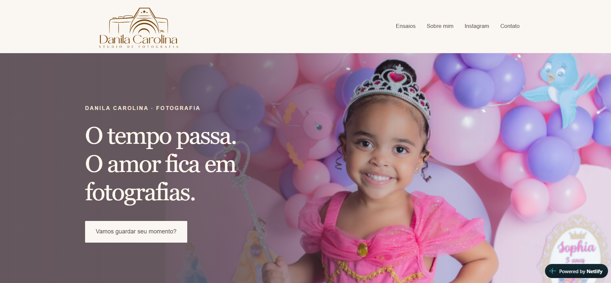

# 📸 Studio Danila Carolina — Website Fotográfico

Website institucional desenvolvido para o **Studio Danila Carolina**, com foco em fotografia newborn, gestante, infantil e família.

O projeto foi pensado para transmitir sensibilidade, acolhimento e valorização das memórias familiares, com uma experiência visual elegante e responsiva.

## ✨ Sobre o projeto

- 📱 Layout responsivo para desktop e mobile
- 📸 Portfólio organizado por tipos de ensaio
- 🤰 Seção para ensaios de gestante
- 👶 Fotografia newborn e infantil
- 👨‍👩‍👧‍👦 Ensaios de família
- 🎨 Identidade visual delicada e profissional
- 📲 Integração com Instagram
- 💬 Contato direto via WhatsApp
- 🧭 Navegação simples e intuitiva
- ✨ Experiência visual focada na fotografia

## 🌐 Projeto online

👉 [Acessar o site](https://studiodanilacarolina.netlify.app/)

## 🛠️ Recursos utilizados

## 💡 Desenvolvimento

O projeto envolveu planejamento da estrutura, construção da identidade visual, organização do portfólio, adaptação para diferentes tamanhos de tela e integração dos principais canais de contato.

A proposta foi criar uma presença digital que valorizasse as fotografias e transmitisse a essência do trabalho do estúdio sem deixar a navegação pesada ou excessivamente comercial.
